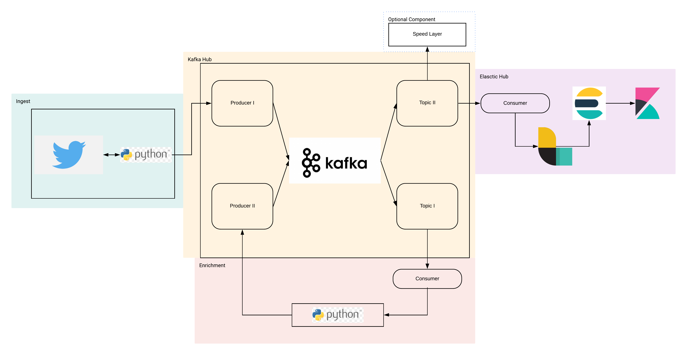

# BigDataTwitter

## Tools:

## Infrastructure:

El objetivo de este proyecto es mostrar lo aprendido durante el quinto cuatrimestre en la materia **BigData**, como proyecto desarrollamos un pipeline por el cual minamos datos de Twitter mediante la libreria [Twint]() los ingestamos en un topico de  [kafka Confluent](), para posteriormente enriquecer los datos mediante python asi mismo ingestarlos a un nuevo topico para su indexacion en [ElasticSearch]() usando como intermediario [Logstash]() y como componente final usariamos [Kibana]() para la visualizacion de datos.

## Como acontinuacion se muestra en la imagen:

Para facilitar la instalacion decidimos crear un instalador programado en bash para acelerar la instalacion y el despliege en los nodos o clusters.

## Instrucciones de Instalacion

git clone https://github.com/DanielDCM212/BigDataTwitter.git

cd BigDataTwitter

bash InstallHub.sh

## Ejecucion del programa